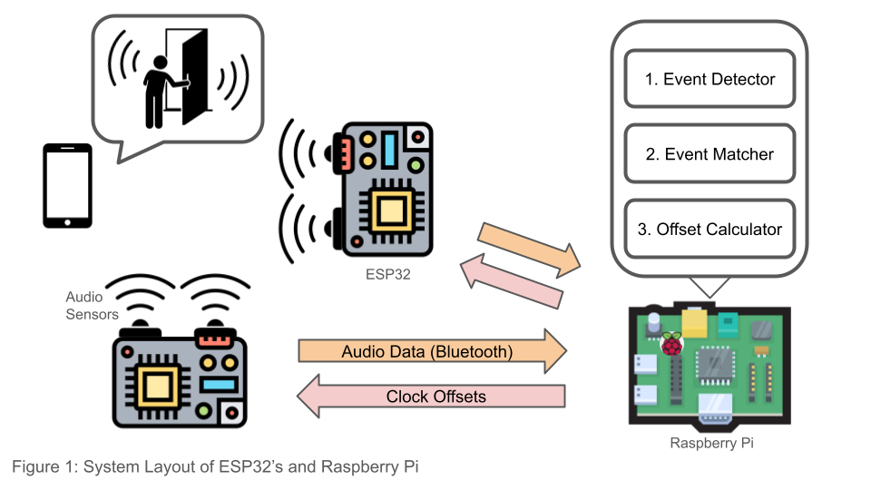

# Time-sensing-535-635

## Team Members
1. Panashe Mandebvu
2. Jenny Yang
3. Joshua Gu

## Introduction
The use of Internet of Things (IoT) devices has increased by 11.7% since 2024 [2]. Accurate time synchronization is essential for these devices to communicate effectively and record events reliably. IoT networks are increasingly heterogeneous due to differences in communication systems and sensing capabilities. Traditional network-based synchronization protocols, such as Network Time Protocols (NTP) [4] and IEEE 1588 [5], have high energy costs since they rely on frequent packet transmissions. Moreover, many IoT devices are resource-constrained, limiting their ability to continuously access central servers for synchronization. These limitations reduce the effectiveness of sensors in certain applications and environments [1][3].

To address this, we propose an event-sensing-based synchronization solution. This reduces the energy requirements by eliminating the need for continuous communication with external gateways. Importantly, it requires no additional hardware, instead leveraging the inherent sensing capabilities of IoT devices to harness freely available ambient events (background events such as doors being slammed, people laughing, sudden pressure and light changes) [1][6][7].

## Design Goals
Our goal is to replicate the time syncing system modeled in HAEST. This refers to a scalable, cost efficient, universal time synchronization system that solves the inherent latencies and shortcomings of current time-syncing protocols. 

This system demonstrates an receiver-to-receiver (R2R) syncing approach that utilizes two sensing modalities (of the same type) attached to two low power microcontrollers (ESP-32s). The two low power devices (IoT devices) are responsible for timestamping sensed ambient events. These events are sent to a gateway device (Raspberry Pi) which is responsible for computing the time-sync of the IoT devices. The gateway correlates the timestamps of the event across the sensors in order to calculate clock offset and frequency drift between the two IoT devices. In order to minimize power consumption in time syncing, the IoT devices will utilize ESP-E2’s bluetooth module to stream data to the gateway device. 

This approach to time synchronization allows for the addition of new sensing modalities into the same distributed system while minimizing calibration cost.

## Deliverables
1.	Enable synchronization using ambient audio events recorded by edge devices (ESP32).
2.	Develop an audio-based time synchronization protocol with sub-millisecond accuracy.
3.	Develop a resource efficient framework which uses the Raspberry Pi for synchronization tasks and the edge devices ESP32s for event recording only. 
4.	(Optional: If there is more time) Integrate another sensor to prove scalability of the implemented solution

## System Design
The following diagram shows our setup for calculating clock offsets from 2 ESP32's using a Raspberry Pi acting as the gateway device. The main role for the ESP32's is to collect and forward sensor data using 2 audio sensors on each ESP32. We will play some sound on a phone (like a door slamming) to simulate ambient sounds for the sensors. The Raspberry Pi collects the timestamped sensor data and calculates the clock drift of the devices. Following the HAEST paper (under [References](./README.md#References)), we predict to use a similar algorithm for identifying when 2 ESP32's detect the same event (sound from phone) using event detection and event matching algorithms.

## Hardware/Software Requirements
* ESP-32 (2)
* Raspberry Pi (1)
* Sound Sensors (2)
## Team Roles

## Project Timeline
We have a rough estimate of tasks to do as well as when they should be done. While we don't have exact dates, we have estimates based on the month. The bullet points for each month are in order of which should be done first, though some tasks can be done at the same time independently:

* October
  * Read up on specifications of ESP32 and Raspberry Pi, search for helpful third party software/frameworks
  * Have code for ESP32 to collect timestamped data from audio sensors, verify sound is detected properly at the correct timestamp
  * Be able to send data from ESP32 to Raspberry Pi through some protocol, verify Raspberry Pi receives correct data
  * Collect various data for sound events using phone as audio source
  * OPTIONAL: If have time, begin work on event detection, have code to detect an event on a single ESP32
* November
  * Have code to match an event on an ESP32 to the correct event on a second ESP32 (**hard**)
  * Have code to calculate clock drift when given 2 matching events
  * Verify that clock drift calculations are accurate
  * Begin research report
* December (2 weeks at most)
  * Finish research report
  * Presentations

## References
1. A. Nasrullah and F. M. Anwar, "HAEST: Harvesting Ambient Events to Synchronize Time across Heterogeneous IoT Devices," 2024 IEEE 30th Real-Time and Embedded Technology and Applications Symposium (RTAS), Hong Kong, Hong Kong, 2024, pp. 265-279
2.	Himanshu Singhvi. (2025). “ The Internet of Things in 2025: Trends, Business Models,  and  Future Directions for A Connected World.”  International Journal of Internet of Things (IJIOT), 3(1), 17-24
3.	F. Mokaya, R. Lucas, H. Noh, and P. Zhang, “Burnout: A wearable system for unobtrusive skeletal muscle fatigue estimation,” 04 2016, pp. 1–12.
4.	D. L. Mills, “Internet time synchronization: the network time protocol,” IEEE Transactions on Communications, vol. 39, no. 10, pp. 1482–1493, 1991.
5.	K. Lee, J. C. Eidson, H. Weibel, and D. Mohl, “Ieee 1588-standard for a precision clock synchronization protocol for networked measurement and control systems,” in Conference on IEEE, vol. 1588, 2005, p. 2.
6. Lex Fridman, Daniel E. Brown, William Angell, Irman Abdić, Bryan Reimer, Hae Young Noh, "Automated synchronization of driving data using vibration and steering events, Pattern Recognition Letters", Volume 75, 2016, Pages 9-15,
7. S. S. Sandha, J. Noor, F. M. Anwar and M. Srivastava, "Exploiting Smartphone Peripherals for Precise Time Synchronization," 2019 IEEE International Symposium on Precision Clock Synchronization for Measurement, Control, and Communication (ISPCS), Portland, OR, USA, 2019, pp. 1-6,
